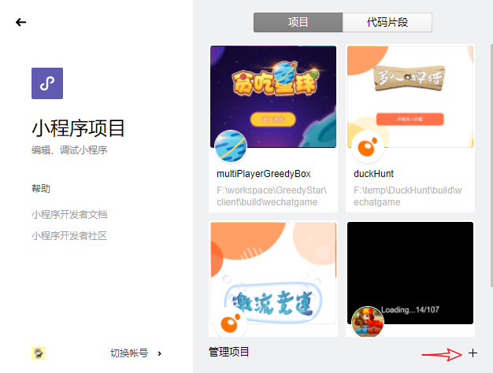
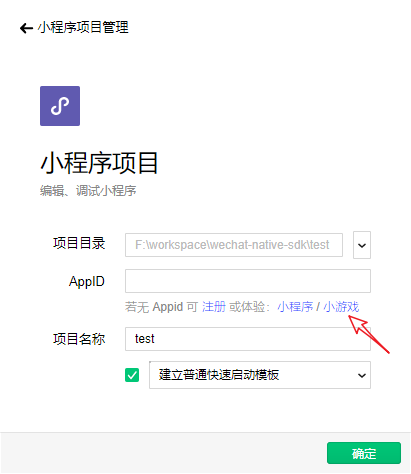
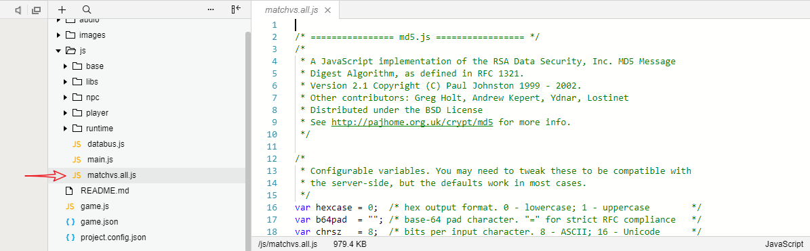

## 如何在微信小游戏中直接使用Matchvs SDK呢?

### 步骤一:
新建一个微信小游戏项目.


注意:创建项目的时候,如果没有appID, 可点击下图中的'小游戏'按钮体验.


查阅[微信小游戏开发者文档](https://developers.weixin.qq.com/minigame/dev/), 学习基本概念.

### 步骤二: 
下载[Matchvs JavaScript SDK](http://www.matchvs.com/serviceDownload), 将下载好的压缩包解压, 将其中的文件matchvs.all.js复制到该小游戏项目中, 可放置在小游戏项目的js文件下(实际上, 放在项目的任何位置都可以).



### 步骤三:
在代码中引入matchvs.all.js.

```javascript
// 例如在game.js中引入
// 理论上,确保在使用其接口之前,可以在任何位置引入
require('./js/matchvs.all.js')
```

### 步骤四:
```javascript
// --game.js

// 实例化MatchvsEngine,MathcvsResponse对象
let matchvsEngine = new MatchvsEngine()
let matchvsResponse = new MatchvsResponse()

// 初始化
matchvsEngine.init(matchvsResponse, GameData.channel, GameData.platform, GameData.gameId)

// 注册
matchvsEngine.registerUser()

// 登陆
matchvsEngine.login(GameData.userId, GameData.token,
        GameData.gameId, GameData.gameVersion, GameData.appKey,
        GameData.secretKey, GameData.deviceId, GameData.gatewayId)
// ...
```